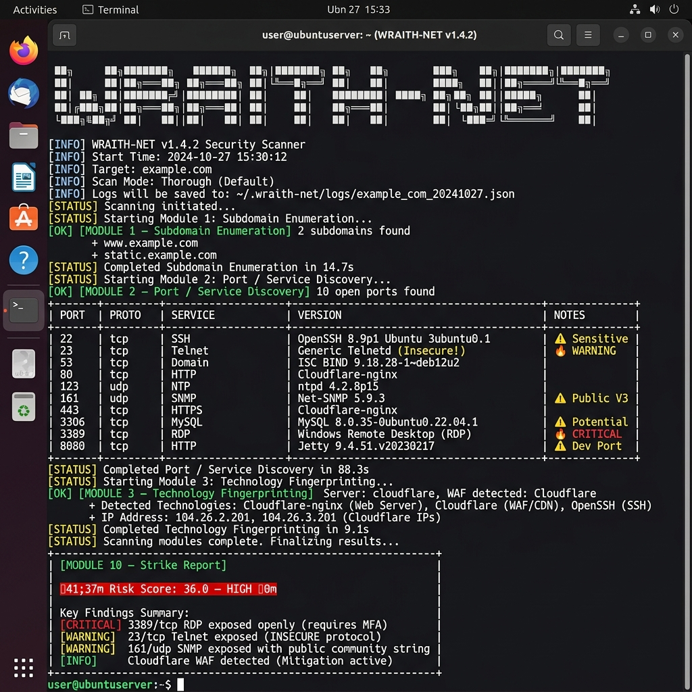
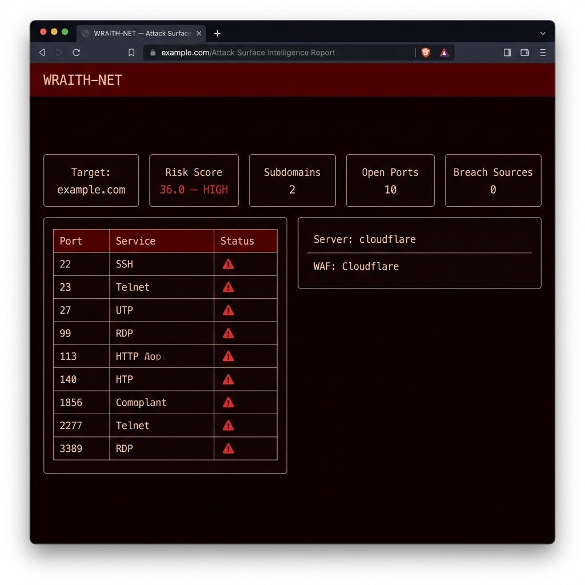

# WRAITH-NET

A lightweight attack surface recon tool written in pure Python. Passive OSINT subdomain scraping, fast socket port scanning, technology detection, DNS/SPF/DMARC audits, and threat intelligence correlation.

All results get saved as JSON, markdown tables, and a dark-themed HTML report.

## Demo

Testing it on `example.com`:

### Terminal Output


### Self-Contained HTML Dashboard


---

## Setup & Run

### Install
```bash
git clone https://github.com/ne0k1r4/wraith-net
cd wraith-net
pip install -e .
```

Uses only python stdlib plus `rich` for terminal output formatting.

### Commands

Run a quick scan (skips slower external breach APIs):
```bash
wraith-net quick target.com
```

Run a full scan with active DNS brute-forcing and AXFR queries:
```bash
wraith-net scan target.com --axfr --brute-subs
```

---

## Keys Configuration
If you want Shodan/GitHub/VirusTotal modules active, drop your keys in `~/.wraith-net/config.json`:
```json
{
  "virustotal_api_key": "your_key",
  "github_api_key": "your_pat",
  "shodan_api_key": "your_key"
}
```
